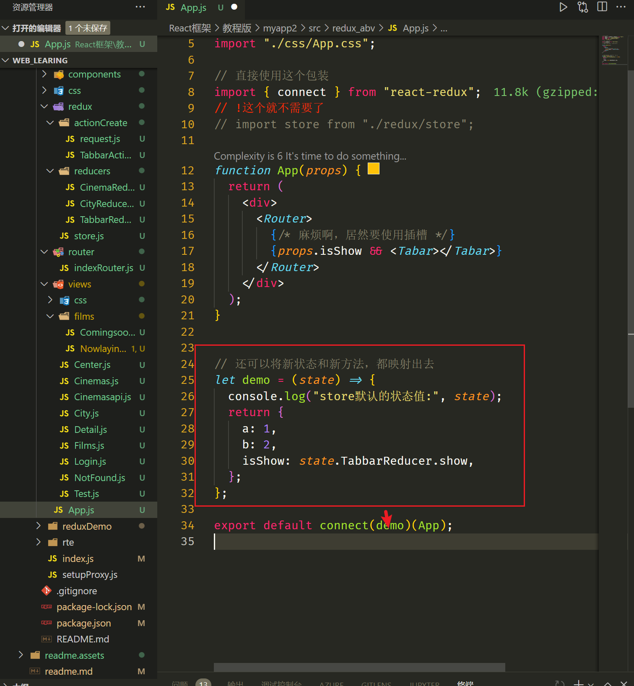
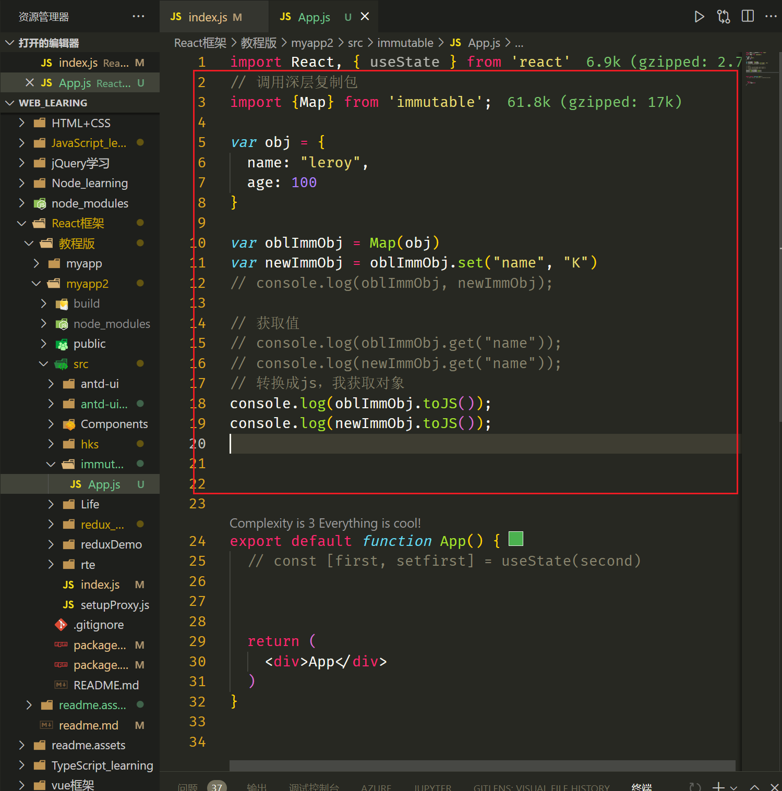
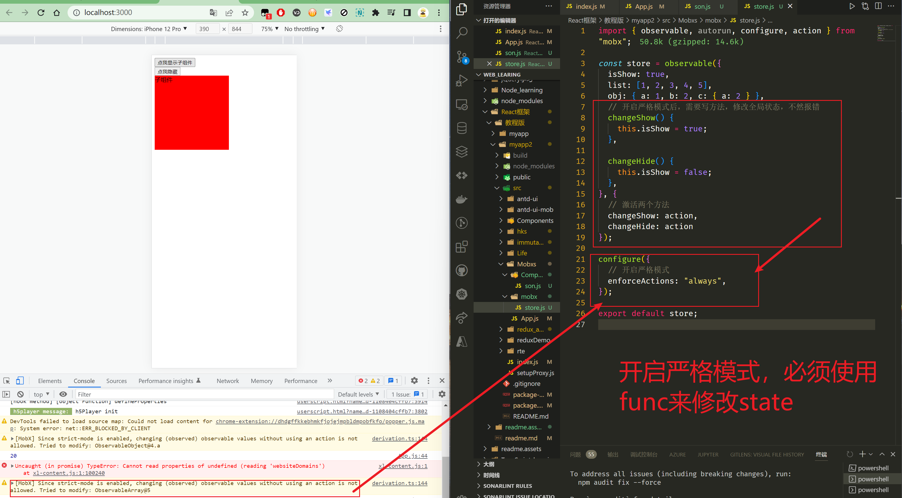
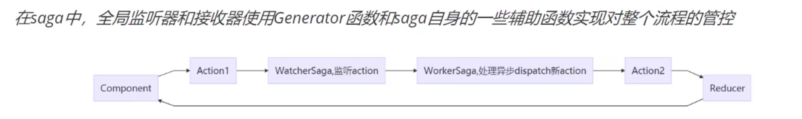
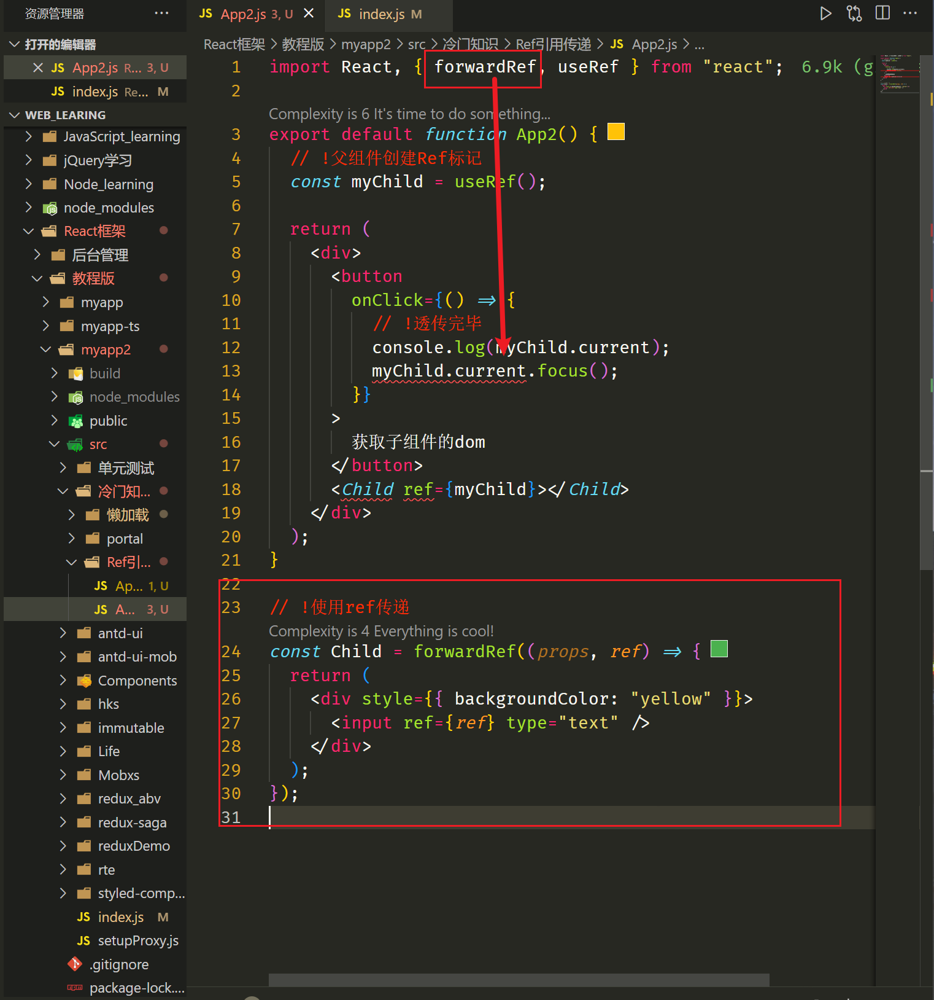
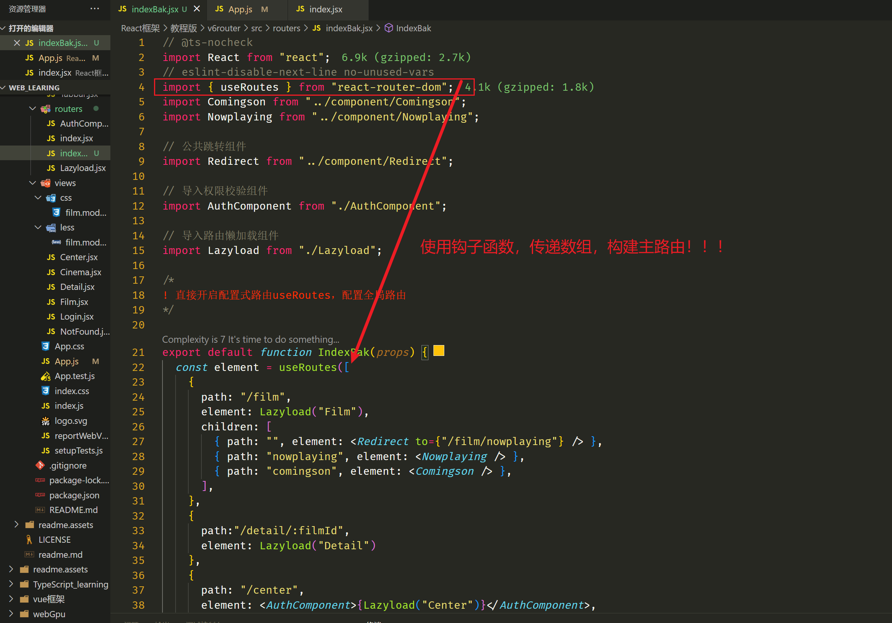

# react学习

##  基本介绍

**核心是能用js的原生写法，就用js的原生写法**


都是后端渲染SSR模式，也都支持前后端分离。

和vue一样，拥有自己的开发插件。


### 传统MVC模型：

M：model模型（数据库的表抽象化成类）

V：view视图（只监听视图的请求）

C：controlled控制器（处理请求，链接MV的逻辑）

### 传统MTV模型：

M：model模型（数据库的表抽象化成类）。

V：view视图，是处理业务逻辑，控制数据呈现逻辑。

T：Template（模板）模板引擎，模板渲染。django模板，jinja2模板。

### MVVM模式：

前身是**MVP模式**：

M：model数据库抽象（将表抽象成类）

V： view视图控制（控制渲染）

P： presenter控制器，（视图view可以直接控制部分model，无需经过presenter ）

**mvvm模式：**

解决了MVP大量的手动View和Model同步的问题，提供双向绑定机制。

m：model数据模型

v：view渲染视图

vm：视图模型（双向绑定数据）

## 组件化：

将html页面上的标签，样式，js代码，封装成一个独立的模块，进行开发。然后统一的挂载到一个页面中。实现了模块化和代码复用。

## 特性：


虚拟dom操作：避免回流和重绘（消耗性能）


## 学习和测试

这个不是我们学的，只能拿来说一下。

通过script标签加载js文件，避免跨域问题，crossorigin设置请求头。

```
<script crossorigin src="https://unpkg.com/react@18/umd/react.development.js"></script>
<script crossorigin src="https://unpkg.com/react-dom@18/umd/react-dom.development.js"></script>
```

## 全局安装脚手架（重点）

```
# 全局安装脚手架
npm i -g create-react-app
# 调用命令
create-react-app your-app
```

```
# 直接网络映射构建脚手架
npx create-react-app your-app
```

安装三个东西


npm run eject

精通者使用，保留源码的同时，使用webpack 和 npm进行自定义构建。

脚手架基本结构（记得别备份node_modules，太大了）


其他插件，组件，功能，会在随后的学习中逐个介绍。

 

### 解决报错


解决js中写入jsx语法，报错的问题:

1.文件后缀改成js=>jsx

2.使用babel，进行转换@babel/plugin-transform-react-jsx

```
npm install --save-dev @babel/plugin-transform-react-jsx-compat
```

```
babel --plugins @babel/plugin-transform-react-jsx-compat index.js
```

混写jsx语法时，记得关闭jshint插件，在react中一点都不好用。

推荐使用eslint插件，原生支持jsx语法。

## ★JSX语法

jsx将html语法直接加入到JavaScript代码中，再通过翻译器转换到纯JavaScript后由浏览器执行。在实际开发中，jsx在打包阶段都已经翻译成纯JavaScript，不会带来任何副作用，反而让代码更加直观并易于维护。编译过程都是由babel的jsx编译器实现。

class组件

ES6的加入让JavaScript直接支持使用class类定义一个类，react创建组件的方式就是使用类的继承，ES6 class时目前官方推荐的使用方式，它使用了ES6标准语法来构建。

## ★组件Components

### class组件
快捷键：rcc


### func组件
快捷键：rfc


### 组件的嵌套


### 模板语法
{}


### 组件的样式


### 事件操作


**事件代理，将事件绑定在父元素上，通过e.target去触发子元素事件**

### Ref的应用（数据绑定）


这里就开始对数据绑定，实现响应式。


### 组件的数据挂载

#### 状态state


说白了就是无限滚动，不断比较滚轮距离和视口大小，利用数据代理替换已渲染的数据。


直接操作数组状态


#### 条件渲染

{逻辑判断} => 实现dom标签的渲染 


##### 注意点：

1.事件与状态的同步和异步关系。

奇怪的地方。 


2.引入插件

```
npm i @better-scroll/core
```


####  属性props

state是组件自身的属性，只能组件自身使用。

给组件的标签传入属性值，然后组件通过props就可以调用了。


##### 使用方式


属性默认值和验证方式


##### 函数式组件


#### state和props的区别


state可以调用setState进行修改。但是props是一个只读属性，无法直接修改。

**react推荐多写无状态组件。**

## 表单中的受控和非受控

### 非受控组件


#### 受控组件


## 消息通信

### 父子通信

#### 父传子：

调用子组件的标签，然后通过标签属性传递数据。


子组件通过props对象接收，验证


#### 子传父:

 将父组件的回调函数，传递给子组件，然后由子组件调用。回调函数本身就可以传参，只需将实参带入即可。


最好做成无状态state组件。

子组件的参数完全由父组件供给，这样一来就是完全受控的子组件。


#### Ref标记

vue的Ref是数据包装，给对象走了一个数据代理，实现了响应式。

react的Ref是对象标记，可以获取DOM元素or组件对象，实现数据和事件的共享。


### 非父子通信

#### 状态提升

一层层传递数据和方法，直到有同一个父层级存在时，两个非父子组件的才能互相通信。


#### 发布订阅模式

不同于redux全局状态管理。

基本原理。


#### context状态树传参

使用方式三种:

1.创建独立文件，组件引用传参


2.函数组件，钩子传参


挂载到组件内部，当静态方法使用。


3.直接包裹，使用标签属性传参


## 插槽slot


## 生命周期

```
组件挂载: 
constructor() 第一
static getDerivedStateFromProps() # 静态内部方法 第二
render() 第三
componentDidMount() 第四，挂在dom结束后
```

```
组件的state和props更新时
static getDerivedStateFromProps() # 静态内部方法  第一
shouldComponentUpdate() # 控制dom是否渲染，性能优化的方法 第二
render() 第三
getSnapshotBeforeUpdate() 第四
componentDidUpdate() 第五
```

```
组件卸载
componentWillUnmount()
```

```
错误处理
static getDerivedStateFromError()
componentDidCatch()
```

```
当你需要强制重新渲染时
forceUpdate()
推荐使用
setState()
```

```
组件传参props默认值
CustomButton.defaultProps = {
  color: 'blue'
};
```

```
配合React Developer Tools插件，进行组件的问题诊断，给组件包装个名字
displayName
```

这里API已经过时。


挂载

UNSAFE_componentWillMount() 组件被初始化

componentDidMount() 组件被渲染


监听状态，传参

UNSAFE_componentWillUpdate() 拿到将要更新的dom

componentDidUpdate(*prevProps*, *prevState*) 拿到已更新的dom


考点SCU**优化函数**

shouldComponentUpdate(*nextProps*, *nextState*) 优化dom渲染


UNSAFE_componentWillReceiveProps(*nextProps*) 被父组件触发


componentWillUnmount() 监听组件的销毁，手动关闭事件和定时器


### 新生命周期钩子

static getDerivedStateFromProps(*props*, *state*)  初始化，dom渲染，update更新，被父组件触发。


getSnapshotBeforeUpdate() 这个钩子更常用


### 性能优化

shouldComponentUpdate() 控制dom元素是否重新渲染，以此来优化性能.

PureComponent 纯粹组件功能.


## hooks

rfc函数式组件

### 组件状态

```
基础Hook的生命周期

useState 函数组件状态
useEffect 三个生命周期合并
useContext 状态树


useReducer useState的高级用法
useCallback 优化方法
useMemo 计算属性
useRef 标记dom
useImperativeHandle 暴露给父组件dom
useLayoutEffect	dom加载完毕后，调用
useDebugValue debug标记，控制台
useDeferredValue 防抖，节流, 延时
useTransition 过度任务，不常用
useId 组件属性唯一id

useSyncExternalStore 高级并发渲染
useInsertionEffect useEffect类似，但功能有限
```

useState


### 组件数据处理

★useEffect（处理副作用）

useLayoutEffect（避免页面抖动）


### 记忆函数

useCallback() 存放不常发生变化的状态


### 计算属性

useMemo() 存放需要被计算出来的新对象


### 包装对象

useRef() 一般拿来标记dom，偶尔情况下可以存储临时变量


### 上下文通信

*const* context = useContext(GlobalContext);


### 外部状态

*const* [state, dispatch] = useReducer(first, second, third)


推荐useReducer+createContext两种方法一起使用


### 自定义hooks


这就是对函数式组件的逻辑，方法，事件，状态的全部复用.


## 路由route

```
我们使用v5版本的路由
npm install react-router-dom@5
最新版本是v6 摒弃#hash
npm install react-router-dom
```

前端路由

### 多级路由

这个不常用。


### 嵌套路由：


### 路由重定向:


### 路由导航

声明式导航。

a标签。不适用


编程式导航

三种跳转方式。


### 动态路由

主要是依靠 url进行参数传递。为了让url传递真正的参数，推荐:data语法。


### 路由拦截

需要重新传递props对象


### 路由模式


### 子组件增强

withRouter()直接包装子组件，赋予props


### 反向代理

这就是利用脚手架进行反向代理了。

https://create-react-app.dev/docs/proxying-api-requests-in-development

```
npm install http-proxy-middleware --save
```


### Css module

 CSS样式分割，让每个组件css都不同。加入中间缀components.module.css


## 状态管理Redux

 至于Flux这个老状态中间件，已经停止运维，我们选择redux。

```
npm install redux
```

工作流


 每个状态，每个消息，都可以再次封装。


```
!本质是一个包装过的订阅发布模式，
! store.subscribe() 监听事件
! store.dispatch() 发布事件
! store.getState() 访问最新状态
```

三大原则


不修改原值state，而是深复制原对象，然后在新对象上修改内容。

###  reducer扩展（子状态）

将全局状态拆分成单独的子状态。


子状态组件


### 加入异步中间件

官方推荐：https://redux.js.org/usage/writing-logic-thunks

```
npm i redux-thunk
```


直接发布新状态。


避免重复订阅。我们销毁订阅


这个状态中间件已经不再被维护。

```
npm i redux-promise
```


### 启动redux DevTools插件


### 使用react-redux

https://react-redux.js.org/introduction/getting-started

```
npm install react-redux
```

这就是让react组件和redux组件之间。构建了一个上下文管理组件connect。




#### 高级组件HOC

**相当于对redux进行了二次封装**,**更容易使用了**


这里指的Provider组件，其实就是状态树。


HOC就是利用react-redux，对组件进行二次包装，赋予它state和func两种方法和状态。这样一来，我们就不需要使用store的自带的方法了。


### redux持久化

https://github.com/rt2zz/redux-persist

```
基于redux-persist库
npm install redux-persist
```


新包装


## 三方插件的使用

Antd组件库

```
npm install antd --save
```


### 栅格系统

栅格布局的一种，可以快速行列化。


### 画布布局

几种布局方式。


### 移动端布局

不需要引入样式


## immutable

```
使用深复制js，保证初始值不受到任何改变。
npm install immutable
```




数组的方法


### 这才是常用的API


### redux-immutable


## Mobx新状态管理

redux是官方推荐的全局状态管理包。但是mobx是一个更易用的全局状态管理。

https://mobx.js.org/README.html

基于vue的数据代理同样的方案Proxy。


```
npm install --save mobx
```

### 严格模式的坑

坑！！！！**其实关闭严格模式也可以**



第二个坑


实验性功能，使用装饰器语法。

https://zh.mobx.js.org/enabling-decorators.html

解决异步。


记得取消监听


### 使用mobx-react-lite

```
# 官方推荐更轻量的mobx-react-lite
npm i mobx-react-lite
npm i mobx-react
```


利用状态树，传递store状态。然后监听observer包裹的组件。

类组件，需要包裹一下


函数式组件，则不需要。


## TS脚手架

```
create-react-app myapp-ts --template typescript
```

ts有定义编译成本，多了太多类型提示。

**vscode居然是基于react + Electron构建的桌面应用。**

如果把js重构成ts则要注意了。

### react-class 类组件


### react-hook 方法组件


引入一个概念,说明文档


### router-tsx模式

这里涉及到接口说明文档，一般格式@types/xxxxx


### redux-ts用法


### antd组件用法

```
npm i antd-mobile
```


## styled-components

https://github.com/kristerkari/react-native-css-modules

使用其他样式的方法：less，sass等。

CSS组件，模块化。

```
npm install --save styled-components
&表示父一级
${允许js代码}
```

其实就是利用高阶组件的方法，支持sass语法。


### 透传


### 高级样式组件的用法


### 动画


## 单元测试

```
npm i react-test-renderer
# 搭配测试框架
npm install --save-dev jest
npm test
```

不是白盒测试or黑盒测试。单纯的就是组件测试。

### 浅组件测试


### 事件触发（不推荐使用，有坑）

### 第三方测试enzyme


推荐https://jestjs.io/ 作为最新的测试框架。


## redux-saga

```
全局监听器，流程管理。
npm install redux-saga
```



为了避免状态异步。我们之前引入了redux-thunk和redux-promise处理异步状态值。

就是一个拦截器中间件。拦截了redux的发布dispatch。


通过中间件，将action的内容重新改写。放入异步然后转变为同步接收value。


使用saga这种协程（生成器）方案，也是一种方法。

### 批量监听


### 接力方法


新的语法糖。

#### 使用独立


#### 使用聚合

说白了，就是连独立takeEvery都不要用


## React补充

冷门知识。

### portal

dom节点传送门。把dom渲染到root根节点之外。


解决的痛点


使用createPortal，将jsx传送到某个节点下。


阻止事件冒泡


### 懒加载

组件懒加载。


路由懒加载。

```
 npm i react-loadable
```


### 引用传递ref

Ref技术，Dom标记。



### memo缓存

只针对函数式组件的dom更新优化，至于class组件，有PureComponent高阶组件负责。


## GraphQL

RPC**远程过程调用**是一种规范，它允许在不同的上下文中远程执行一个函数。

**SOAP**是一种XML格式的、高度标准化的网络通信协议。


常用种类。

**REST**是一种由一组架构约束定义的自解释API架构风格，旨在为许多API消费者广泛采用。

- **统一接口**：允许以统一的方式与给定的服务器进行交互，而不考虑设备或应用类型。

- **无状态**：处理请求的必要状态，就像请求本身所包含的那样，服务器不需要存储任何与会话有关的内容。

- **缓存**

- **客户端-服务器架构**：允许任何一方独立进化

- 应用程序的**分层系统**

- 服务器向客户机提供**可执行代码**的能力

  

**GraphQL**是一种描述如何进行精确数据请求的语法。


### 评价：

GraphQL就是一种适合高维大数据的聚合API的规则。

```
https://graphql.org/learn/
```

最大进步，就是api接口是自适应的，前端完全可以通过一定的规则，去请求数据。而不需要后端去改动路由和sql。。。

[点我跳转到node-graphql笔记中](../Node_learning/graphql/readme.md#graphql学习)

## Dva框架
了解即可，已经弃用。

这是一个基于redux，react-router，redux-saga的数据流状态解决方案。

```
# 有自己的脚手架
$ npm install dva-cli -g
$ dva -v
```

### 目录解构

```
dva new dva-quickstart
```

只需要看文件目录，就可以了解到dva脚手架的状态。


## Umi框架

蚂蚁集团对react脚手架的二次开发，框架。

https://umijs.org/docs/tutorials/getting-started

```
# 会有很多配置项，需要根据需求来选择。
npx create-umi@latest
# 这里就是微生成器(构建各种必须插件)
npm i umi
# 使用npm启动服务
npm start
# 还有一个bug，偶尔要安装这个
npm install react-sortable-hoc --save
```

三种安装模式：


### 目录解构


## 新版routerV6

```
npm i react-router-dom@6
```


### 对比V5


### 用法：

#### router导入App

路由模式:


#### 设置routers-index根路由

设置主路由


重定向组件


新API


#### 嵌套路由


#### 编程式跳转

这里我们不再使用<a“>声明式跳转<”/a>

import { NavLink，Link } from 'react-router-dom'

推荐用法

import { useNavigate } from "react-router-dom";


#### ★路由容器


#### 路由传参


动态路由


#### 路由拦截


#### 抽象子组件

不用withRouter，强行赋予props.各种方法.如果是class组件，则还是需要包装一下。


间接使用class组件,withRouter组件。只需要这么用，将class组件，强行变换成func组件，然后class组件HOC高阶方法即可。


#### 路由懒加载

加快启动速度。开启懒加载，则所有组件都会被分割成单独js


#### useRoutes钩子配置



# 分层结构

**使用分层架构时要避免的错误**

-   **过度工程**——保持简单且可扩展的架构，避免使用不遵循 React 模式的设计，例如基于继承的设计。
    
-   **紧耦合**——当层紧密耦合时，在不影响其他层的情况下更改一个层可能很困难。通过使用适当的模式和技术（例如依赖注入和接口）来减少耦合。
    
-   **忽略性能**——如果实施不当，分层架构会影响应用程序性能。在优化架构以提高性能时，请考虑代码拆分、延迟加载和缓存等因素。
    
-   **糟糕的命名约定**——为你的层、组件和函数使用清晰一致的命名约定。否则，从长远来看，开发人员将很难理解和维护代码。
    
-   **缺乏测试**——每一层都应该进行彻底的测试，以确保它按预期工作。未能测试每一层可能会导致最终应用程序中出现错误和其他问题。
    
-   **缺乏凝聚力**——每一层都具有高度的凝聚力。内聚性是指一个层内的功能和职责的相关程度。低内聚性会导致代码难以理解和维护。

## 小技巧

### 严格模式
```js
'use strict';
```
'use client'声明是RSC（React Server Component，服务端组件）协议中的定义。

启用了RSC的React应用，所有组件默认在服务端渲染（可以通过Next v13体验），只有声明'use client'的组件文件，会在前端渲染。

### using 关键字
using关键字是tc39提案ECMAScript Explicit Resource Management[1]提出的，用于为各种资源（内存、I/O等）提供统一的生命周期管理（何时分配、何时释放等）。

```js
{
  const getResource = () => {
    return {
      [Symbol.dispose]: () => {
        console.log('离开啦!')
      }
    }
  }
  using resource = getResource();
}
// 代码执行到这里会打印 离开啦!
```

### use 方法
React v18.3之后发布的新原生hook —— use：
```js
using data = use(ctx);
```

这个hook可以接收两种类型数据：

React Context
此时use的作用与useContext一样。

promise
此时如果这个promise处于pending状态，则最近一个祖先<Suspense/>组件可以渲染fallback。

比如，在如下代码中，如果<Cpn />组件或其子孙组件使用了use，且promise处于pending状态（比如请求后端资源）：
```jsx
function App() {
  return (
    <div>
      <Suspense fallback={<div>loading...</div>}>
        <Cpn />
      </Suspense>
    </div>
  );
}
```

那么，页面会渲染如下结果：
<div>
  <div>loading...</div>
</div>
当请求成功后，会渲染<Cpn />。


# React [18.2.0](https://github.com/facebook/react/releases/tag/v18.2.0)

重开一个新项目，重新学习api